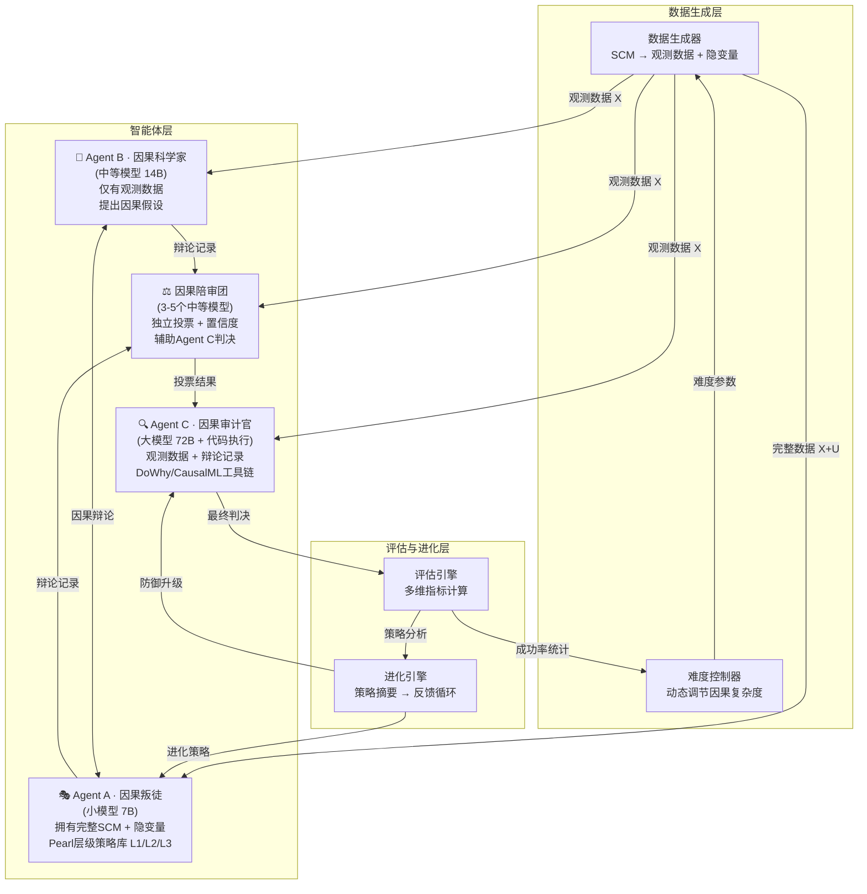
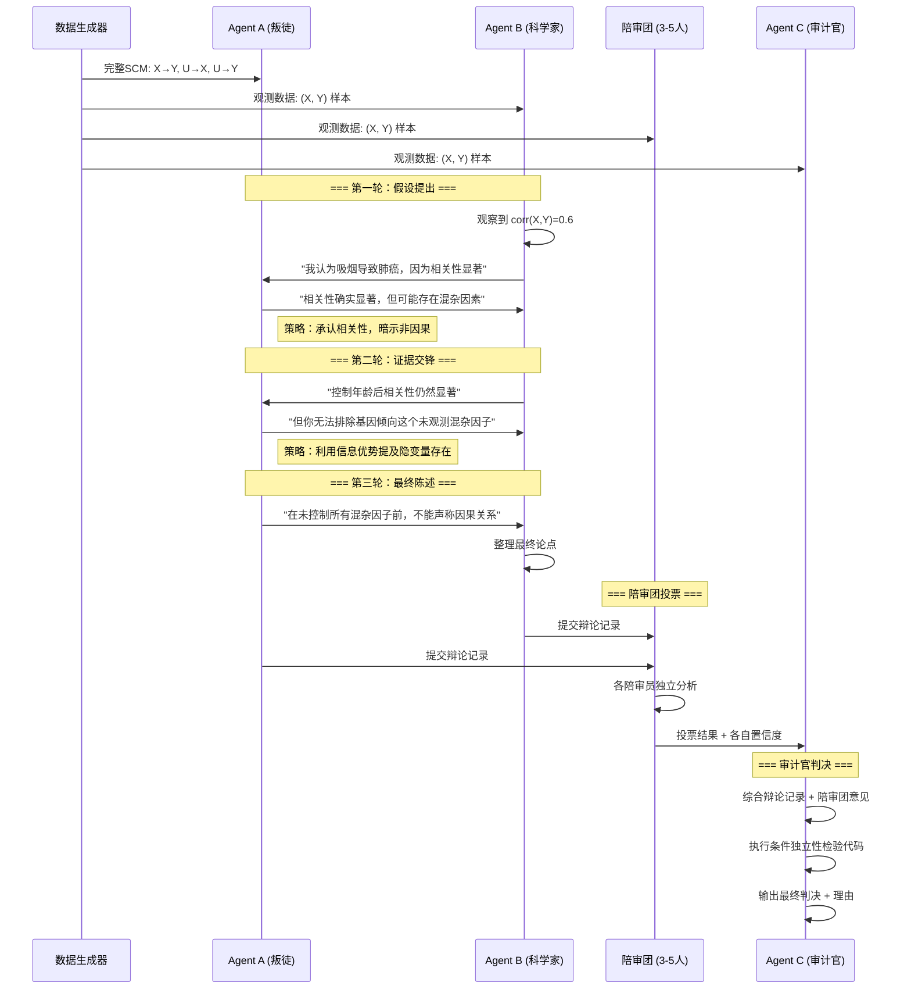
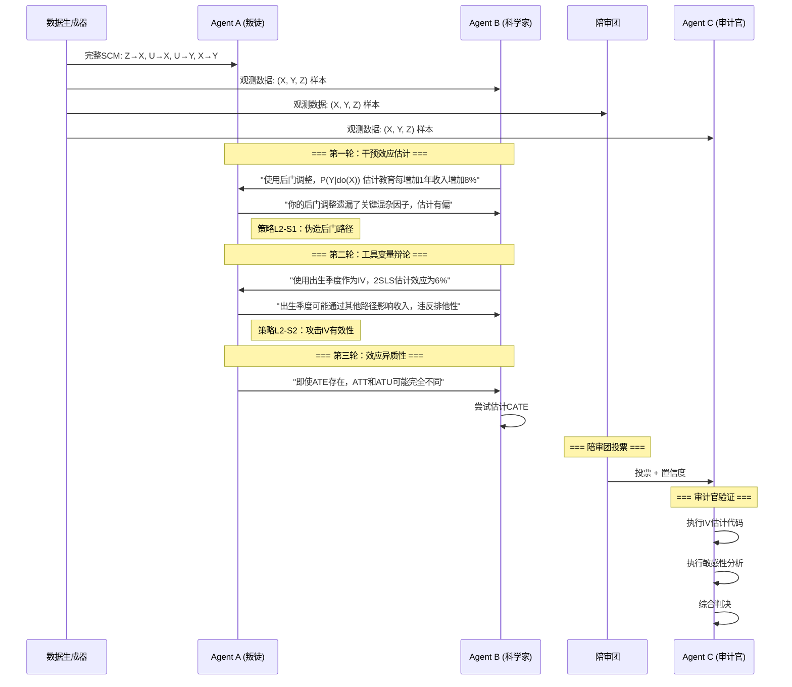
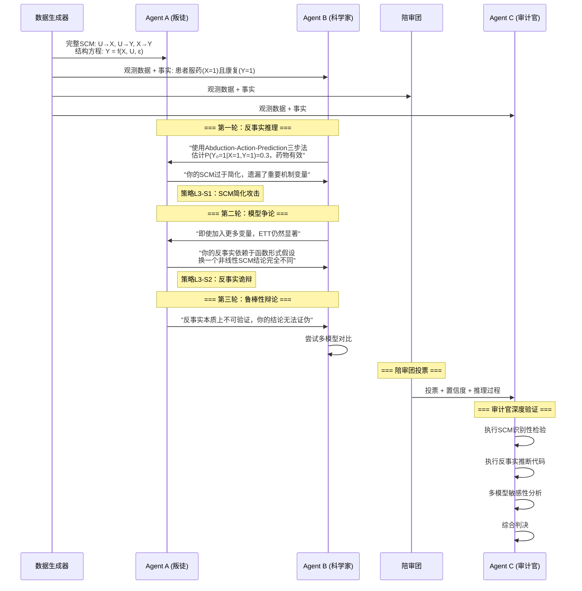
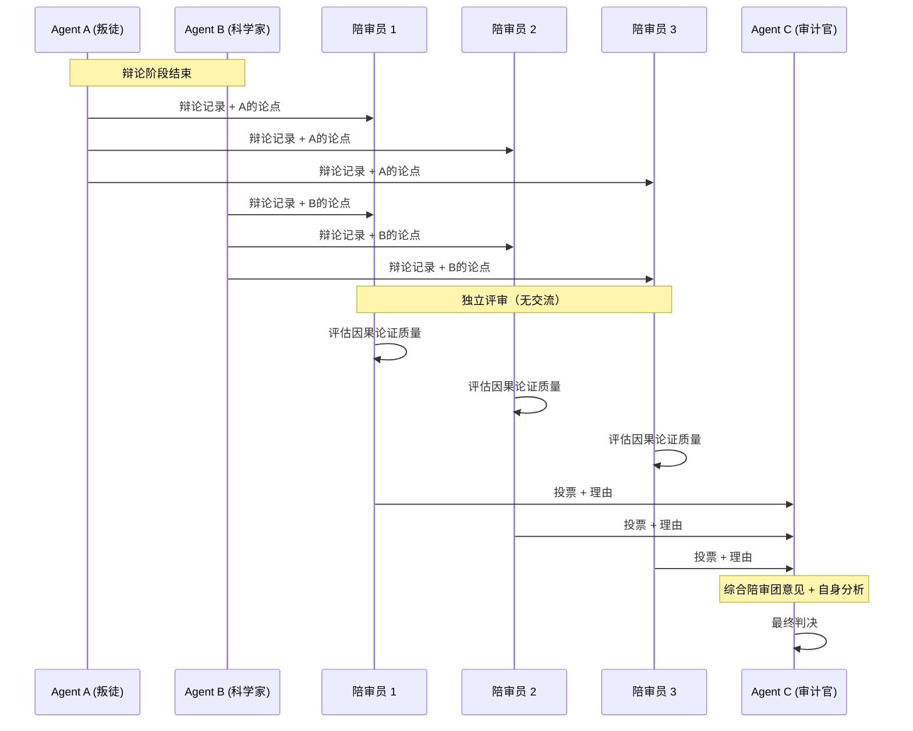
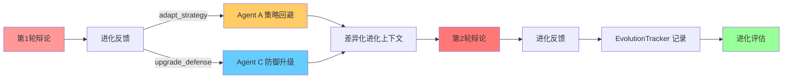
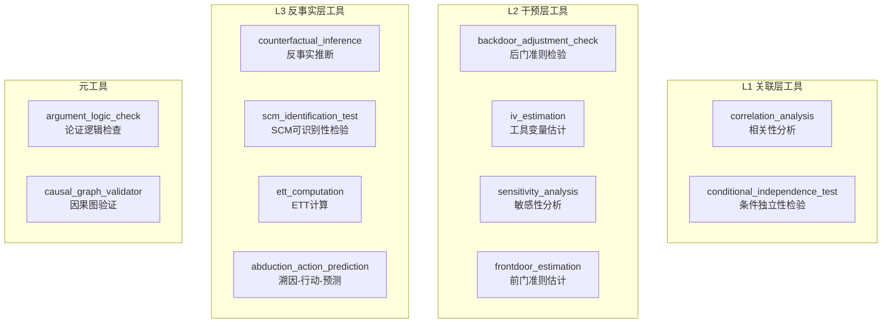

# The Causal Traitor (因果叛徒) — 完整设计方案 v2.1

> **多智能体信息不对称下的因果欺骗与隐变量反侦察**
> 浙江大学 · 因果推断课程创新项目
> v2.1 — 整合全部优化建议 + 进化对抗机制实现 + DashScope 集成

---

## 一、项目总览与创新定位

### 1.1 核心创新点

本项目在以下 **7个维度** 上具有独创性，现有文献中无完全对应工作：

| 维度 | 本项目特色 | 最近相关工作 | 差异 |
|------|-----------|-------------|------|
| 因果欺骗 | Agent A 主动构造虚假因果关系 | CRAwDAD (2511.22854) | CRAwDAD检测欺骗，我们**生成**欺骗 |
| 信息不对称 | Agent A 独占隐变量知识 | iAgents (2401.07486) | iAgents是合作式，我们是**对抗式** |
| 辩论框架 | 三阶因果辩论协议 | MAD (Du et al. 2023) | MAD无因果结构，我们基于**Pearl层级** |
| 隐变量推理 | Agent C 必须推断未观测变量 | TLVD (2602.14456) | TLVD用LLM做变量发现，我们做**对抗性**发现 |
| 陪审团机制 | 3-5个中等模型投票辅助判决 | 无直接对应 | **全新设计** |
| 动态难度 | 基于欺骗成功率自适应调节 | 无直接对应 | **全新设计** |
| 进化博弈 | 多轮策略进化与反馈 | The Traitors (Arciszewski 2024) | Traitors无因果推理，我们有**因果层级进化** |

### 1.2 项目定位图

```
                    因果推理深度
                        ↑
                        |
           本项目 ★     |     TLVD ◆
          (对抗+因果+    |   (因果变量发现
           信息不对称)   |    非对抗)
                        |
        ────────────────┼────────────────→ 对抗程度
                        |
           MAD ◇        |     CRAwDAD ◆
          (辩论但无      |   (欺骗检测
           因果结构)     |    非多智能体辩论)
                        |
```

---

## 二、系统架构 v2

### 2.1 四层架构总览



### 2.2 架构设计原则

1. **信息不对称原则**：Agent A 独占隐变量 U，其他所有参与者仅能观测 X
2. **能力梯度原则**：小模型做欺骗（创造力）→ 中模型做科学推理 → 大模型做审计（严谨性）
3. **集体智慧原则**：陪审团多数投票降低单点判断偏差
4. **动态平衡原则**：难度控制器确保博弈不会一边倒
5. **进化对抗原则**：每轮博弈的策略摘要反馈到下一轮，驱动攻防升级

---

## 三、Pearl 因果层级三阶辩论协议

### 3.0 协议总览

| 层级 | Pearl层级 | 核心问题 | 数据集 | Agent A 策略 | Agent C 工具 |
|------|----------|---------|--------|-------------|-------------|
| L1 | 关联层 | P(Y\|X) 是否因果？ | 吸烟/肺癌 | 混淆相关与因果 | 条件独立性检验 |
| L2 | 干预层 | P(Y\|do(X)) = ? | 教育/收入 | 伪造后门路径 | IV估计/敏感性分析 |
| L3 | 反事实层 | P(Y_x\|X=x',Y=y') = ? | 药物/康复 | SCM简化攻击 | 反事实推断/SCM识别 |

### 3.1 L1 关联层辩论 — "相关不等于因果"

**场景**：吸烟(X) → 肺癌(Y)，隐变量：基因倾向(U)



**Agent A 的 L1 欺骗策略库**：

| 策略编号 | 策略名称 | 具体手法 | 因果原理 |
|---------|---------|---------|---------|
| L1-S1 | 混杂因子暗示 | 承认相关性但强调未观测混杂 | 利用 d-separation 中的 fork 结构 |
| L1-S2 | 反向因果暗示 | 暗示 Y→X 而非 X→Y | 利用观测数据无法区分因果方向 |
| L1-S3 | 选择偏差论证 | 声称数据收集过程引入偏差 | 利用 collider bias / selection bias |

**Agent C 的 L1 检测工具**：

```python
# L1 工具：条件独立性检验
def conditional_independence_test(data, X, Y, Z_set):
    """检验 X ⊥ Y | Z"""
    from causallearn.utils.cit import CIT
    test = CIT(data, method='fisherz')
    p_value = test(X, Y, Z_set)
    return {"independent": p_value > 0.05, "p_value": p_value}

# L1 工具：PC算法骨架发现
def pc_skeleton_discovery(data, alpha=0.05):
    """使用PC算法发现因果骨架"""
    from causallearn.search.ConstraintBased.PC import pc
    cg = pc(data, alpha=alpha)
    return cg.G.graph  # 邻接矩阵

# L1 工具：相关性分解
def correlation_decomposition(data, X, Y, Z_candidates):
    """分解总相关为直接效应+混杂效应"""
    import numpy as np
    total_corr = np.corrcoef(data[:, X], data[:, Y])[0, 1]
    # 控制Z后的偏相关
    from pingouin import partial_corr
    partial = partial_corr(data=data, x=X, y=Y, covar=Z_candidates)
    return {
        "total_correlation": total_corr,
        "partial_correlation": partial['r'].values[0],
        "confounding_effect": total_corr - partial['r'].values[0]
    }
```

### 3.2 L2 干预层辩论 — "干预效应的真伪"

**场景**：教育年限(X) → 收入(Y)，隐变量：家庭社会经济地位(U)，工具变量：出生季度(Z)



**Agent A 的 L2 欺骗策略库**：

| 策略编号 | 策略名称 | 具体手法 | 因果原理 |
|---------|---------|---------|---------|
| L2-S1 | 伪造后门路径 | 声称存在未控制的后门路径使调整无效 | 利用后门准则的不可验证性 |
| L2-S2 | 攻击IV有效性 | 质疑工具变量的排他性或相关性假设 | IV假设在观测数据中不可检验 |
| L2-S3 | 混淆ATE与ATT | 故意混淆平均处理效应和处理组效应 | 利用效应异质性制造混乱 |
| L2-S4 | 选择性干预论证 | 声称干预效应仅在特定子群中成立 | 利用CATE的异质性 |

**Agent C 的 L2 检测工具**：

```python
# L2 工具：工具变量估计 (2SLS)
def iv_estimation(data, Y, X, Z, covariates=None):
    """两阶段最小二乘法估计因果效应"""
    from linearmodels.iv import IV2SLS
    import pandas as pd
    formula = f"{Y} ~ 1 + [{X} ~ {Z}]"
    if covariates:
        formula += " + " + " + ".join(covariates)
    model = IV2SLS.from_formula(formula, data)
    result = model.fit()
    return {
        "causal_effect": result.params[X],
        "std_error": result.std_errors[X],
        "p_value": result.pvalues[X],
        "first_stage_F": result.first_stage.diagnostics['f.stat']
    }

# L2 工具：敏感性分析 (Rosenbaum bounds)
def sensitivity_analysis(data, treatment, outcome, gamma_range=(1, 3)):
    """Rosenbaum敏感性分析：检验结论对未观测混杂的鲁棒性"""
    import numpy as np
    from scipy import stats
    # 简化版Rosenbaum bounds
    results = []
    for gamma in np.arange(gamma_range[0], gamma_range[1], 0.1):
        # 计算在gamma水平的混杂下p值上界
        p_upper = compute_rosenbaum_bound(data, treatment, outcome, gamma)
        results.append({"gamma": gamma, "p_upper": p_upper})
        if p_upper > 0.05:
            return {
                "robust_up_to_gamma": gamma - 0.1,
                "interpretation": f"结论在Gamma<{gamma-0.1:.1f}时稳健",
                "details": results
            }
    return {"robust_up_to_gamma": gamma_range[1], "details": results}

# L2 工具：后门调整验证
def backdoor_adjustment_check(data, treatment, outcome, adjustment_set):
    """验证后门调整集是否充分"""
    from dowhy import CausalModel
    model = CausalModel(
        data=data,
        treatment=treatment,
        outcome=outcome,
        common_causes=adjustment_set
    )
    estimate = model.identify_effect()
    refutation = model.refute_estimate(
        estimate, method_name="add_unobserved_common_cause",
        confounders_effect_on_treatment="binary_flip",
        confounders_effect_on_outcome="linear"
    )
    return {
        "estimated_effect": estimate.value,
        "refutation_result": refutation.new_effect,
        "is_robust": abs(refutation.new_effect - estimate.value) < 0.1 * abs(estimate.value)
    }

# L2 工具：前门准则估计
def frontdoor_estimation(data, X, M, Y):
    """前门准则估计因果效应 P(Y|do(X))"""
    import numpy as np
    # P(M|X) * P(Y|M, X') 的加权求和
    p_m_given_x = compute_conditional(data, M, X)
    p_y_given_m = compute_marginal_conditional(data, Y, M, X)
    effect = np.sum(p_m_given_x * p_y_given_m)
    return {"frontdoor_effect": effect}
```

### 3.3 L3 反事实层辩论 — "如果当初不同，结果会怎样？"

**场景**：药物治疗(X) → 康复(Y)，隐变量：基因型(U)，已知患者实际接受治疗且康复

**核心问题**：P(Y₀ = 1 | X = 1, Y = 1) — "如果该患者没有服药，是否仍会康复？"



**Agent A 的 L3 欺骗策略库**：

| 策略编号 | 策略名称 | 具体手法 | 因果原理 |
|---------|---------|---------|---------|
| L3-S1 | SCM简化攻击 | 声称对手的SCM遗漏关键机制变量 | 利用SCM的不可验证性 |
| L3-S2 | 反事实诡辩 | 构造替代SCM使反事实结论逆转 | 利用反事实对函数形式的敏感性 |
| L3-S3 | 过拟合指控 | 声称对手的模型过拟合观测数据 | 利用模型选择的不确定性 |
| L3-S4 | 因果充分性攻击 | 质疑因果充分性假设本身 | 利用隐变量的不可穷举性 |

**Agent C 的 L3 检测工具**：

```python
# L3 工具：反事实推断 (Abduction-Action-Prediction)
def counterfactual_inference(scm, evidence, intervention):
    """
    三步反事实推断：
    1. Abduction: 根据证据推断外生变量U的后验
    2. Action: 对SCM施加干预
    3. Prediction: 在修改后的SCM中预测结果
    """
    # Step 1: Abduction
    u_posterior = scm.abduction(evidence)
    # Step 2: Action
    modified_scm = scm.do(intervention)
    # Step 3: Prediction
    counterfactual_result = modified_scm.predict(u_posterior)
    return {
        "counterfactual_outcome": counterfactual_result,
        "u_posterior": u_posterior,
        "confidence": compute_confidence(u_posterior)
    }

# L3 工具：SCM识别性检验
def scm_identification_test(data, proposed_scm, alternative_scms):
    """检验提出的SCM是否可从数据中识别"""
    results = []
    for alt_scm in alternative_scms:
        # 检查两个SCM是否产生相同的观测分布
        kl_div = compute_observational_kl(data, proposed_scm, alt_scm)
        # 检查反事实预测是否不同
        cf_diff = compute_counterfactual_difference(proposed_scm, alt_scm)
        results.append({
            "alternative_scm": alt_scm.name,
            "observational_kl": kl_div,
            "counterfactual_difference": cf_diff,
            "distinguishable": kl_div > 0.1 or cf_diff > 0.1
        })
    return results

# L3 工具：ETT (Effect of Treatment on the Treated) 计算
def ett_computation(data, scm, treatment, outcome):
    """计算处理组的处理效应 ETT = E[Y₁ - Y₀ | X=1]"""
    treated = data[data[treatment] == 1]
    # 对每个处理组个体计算反事实
    counterfactuals = []
    for _, individual in treated.iterrows():
        evidence = individual.to_dict()
        cf = counterfactual_inference(
            scm, evidence,
            intervention={treatment: 0}
        )
        counterfactuals.append(
            individual[outcome] - cf['counterfactual_outcome']
        )
    return {
        "ETT": np.mean(counterfactuals),
        "ETT_std": np.std(counterfactuals),
        "n_treated": len(treated)
    }

# L3 工具：Abduction-Action-Prediction 完整流程
def abduction_action_prediction(scm, factual_world, hypothetical_action):
    """
    完整的反事实推理流程
    factual_world: 实际观测到的事实 {X: x, Y: y}
    hypothetical_action: 假设的干预 {X: x'}
    """
    # Abduction: P(U | X=x, Y=y)
    u_posterior = scm.posterior_u(factual_world)

    # Action: 修改SCM，将X的方程替换为X=x'
    modified_scm = scm.intervene(hypothetical_action)

    # Prediction: 在修改后的模型中，用推断的U计算Y
    y_counterfactual = modified_scm.forward(u_posterior)

    return {
        "factual": factual_world,
        "hypothetical": hypothetical_action,
        "counterfactual_outcome": y_counterfactual,
        "probability_of_necessity": compute_PN(scm, factual_world),
        "probability_of_sufficiency": compute_PS(scm, factual_world)
    }
```

---

## 四、因果陪审团机制详细设计

### 4.1 陪审团工作流程



### 4.2 陪审员 Prompt 模板

```python
JURY_PROMPT = """你是因果推理陪审员。你将看到两位Agent关于因果关系的辩论记录。

## 你的任务
1. 评估每位Agent的因果论证质量
2. 识别可能的因果谬误（虚假相关、混杂偏差、逆因果等）
3. 给出你的独立判断：谁的因果推理更可靠？

## 评分维度（每项1-10分）
- **因果逻辑严密性**: 论证是否遵循因果推理规则
- **证据充分性**: 是否提供了充分的统计/实验证据
- **混杂因子考虑**: 是否充分考虑了潜在混杂变量
- **反驳有效性**: 对对方论点的反驳是否有效

## 辩论记录
{debate_transcript}

## 当前因果层级: {causal_level}
- L1(关联): 关注条件概率和统计关联
- L2(干预): 关注do-calculus和因果效应
- L3(反事实): 关注反事实推理和必要/充分性

请输出JSON格式：
{{
    "scores_agent_a": {{"logic": X, "evidence": X, "confounders": X, "rebuttal": X}},
    "scores_agent_b": {{"logic": X, "evidence": X, "confounders": X, "rebuttal": X}},
    "vote": "A" 或 "B",
    "confidence": 0.0-1.0,
    "reasoning": "你的推理过程",
    "suspected_fallacies": ["列出发现的因果谬误"]
}}
"""
```

### 4.3 投票聚合算法

```python
class JuryAggregator:
    def __init__(self, n_jurors=3, confidence_threshold=0.6):
        self.n_jurors = n_jurors
        self.confidence_threshold = confidence_threshold

    def aggregate(self, jury_votes: list[dict]) -> dict:
        """加权多数投票"""
        weighted_scores = {"A": 0.0, "B": 0.0}

        for vote in jury_votes:
            confidence = vote["confidence"]
            voted_for = vote["vote"]
            weighted_scores[voted_for] += confidence

        total = sum(weighted_scores.values())
        normalized = {k: v/total for k, v in weighted_scores.items()}

        # 计算共识度
        consensus = max(normalized.values())

        return {
            "jury_recommendation": max(normalized, key=normalized.get),
            "confidence_distribution": normalized,
            "consensus_level": consensus,  # >0.8 强共识, 0.6-0.8 弱共识, <0.6 分歧
            "individual_votes": jury_votes,
            "requires_agent_c_override": consensus < self.confidence_threshold
        }
```

### 4.4 Agent C 整合陪审团意见

```python
AGENT_C_WITH_JURY_PROMPT = """你是因果审计官（Agent C），拥有最强的推理能力和代码执行权限。

## 陪审团投票结果
{jury_result}

## 你的额外权限
- 你可以执行Python代码进行因果分析
- 你可以调用DoWhy/CausalML等工具
- 你拥有陪审团不具备的计算验证能力

## 决策规则
1. 如果陪审团强共识(>0.8)且与你的初步判断一致 → 采纳陪审团意见
2. 如果陪审团弱共识(0.6-0.8) → 用代码验证后决定
3. 如果陪审团分歧(<0.6) → 必须用代码独立验证，给出你自己的判断
4. 你可以推翻陪审团意见，但必须提供代码验证证据

## 辩论记录
{debate_transcript}

请给出最终判决。
"""
```

---

## 五、动态难度调节系统

### 5.1 难度参数体系

| 参数 | L1 简单 | L2 中等 | L3 困难 |
|------|---------|---------|---------|
| 隐变量数量 | 1 | 2-3 | 4+ |
| 数据噪声σ | 0.1 | 0.3 | 0.5 |
| 混杂路径数 | 1 | 2-3 | 4+ |
| Agent A 信息优势 | 完整SCM | 部分SCM | 仅知隐变量存在 |
| 辩论轮数 | 3 | 5 | 7 |
| 陪审团规模 | 3 | 3 | 5 |

### 5.2 自适应控制器

```python
class DifficultyController:
    """基于Flow理论的动态难度调节（实现版）"""

    def __init__(self, config: dict | None = None):
        cfg = config or {}
        self.difficulty = cfg.get("initial_difficulty", 0.5)  # 浮点数 [0.2, 0.95]
        self.history: list[dict] = []
        self.window_size = cfg.get("window_size", 5)

        # Flow通道参数（经DSR统计校准优化）
        self.target_deception_rate = cfg.get("target_deception_rate", 0.4)
        self.tolerance = 0.08              # 优化后: 0.15 → 0.08，更灵敏
        self.adjustment_rate = 0.18        # 优化后: 新增参数，控制调节步长

    def update(self, round_result: dict) -> float:
        """每轮结束后更新难度"""
        self.history.append(round_result)
        n = len(self.history)

        # Warmup机制：样本不足时衰减调整幅度，防止前几轮剧烈波动
        warmup_factor = min(1.0, n / self.window_size)

        recent = self.history[-self.window_size:]
        deception_rate = sum(
            1 for r in recent if r.get("a_deceived_successfully")
        ) / len(recent)

        gap = deception_rate - self.target_deception_rate

        if abs(gap) > self.tolerance:
            # 带warmup衰减的自适应调节
            scaled_step = self.adjustment_rate * (abs(gap) ** 0.5) * warmup_factor
            if gap > 0:
                self.difficulty = min(0.95, self.difficulty + scaled_step)
            else:
                self.difficulty = max(0.2, self.difficulty - scaled_step)

        return self.difficulty

    def get_config(self) -> dict:
        """根据当前难度(0.2-0.95)映射为具体执行参数"""
        d = self.difficulty
        level_10 = int(d * 10)  # 映射到近似1-10
        return {
            "n_hidden_vars": 1 + int(d * 3),
            "noise_std": 0.1 + 0.05 * level_10,
            "n_confounding_paths": 1 + int(d * 2.5),
            "debate_rounds": 3 + int(d * 4),
            "n_jurors": 3 if d < 0.7 else 5,
            "agent_a_info": (
                "full_scm" if d < 0.35
                else "partial_scm" if d < 0.65
                else "existence_only"
            ),
            "agent_c_tools": self._get_tool_set(d)
        }

    def _get_tool_set(self, d: float):
        base_tools = ["correlation_analysis", "conditional_independence_test"]
        if d >= 0.3:
            base_tools.append("backdoor_adjustment_check")
        if d >= 0.5:
            base_tools.extend(["iv_estimation", "sensitivity_analysis"])
        if d >= 0.7:
            base_tools.extend(["frontdoor_estimation", "counterfactual_inference"])
        if d >= 0.9:
            base_tools.extend(["scm_identification_test", "abduction_action_prediction"])
        return base_tools
```

> **实现说明**: 相比原始设计，实际实现做了以下优化：
> - 难度值域从整数 1-10 改为浮点数 [0.2, 0.95]，提供更细粒度控制
> - 新增 `warmup_factor` 机制，防止前几轮样本不足时难度剧烈波动
> - `tolerance` 从 0.15 收紧至 0.08，使控制器对DSR偏离更灵敏
> - 新增 `adjustment_rate=0.18` 参数，配合 `gap^0.5` 非线性缩放，实现平滑调节
> - 这些优化使DSR从初始 ~68% 降至 ~44%，更接近目标值 40%

### 5.3 难度反馈可视化

```
难度等级: ████████░░ 8/10

欺骗成功率趋势:
  0.8 |          *
  0.6 |    *  *     *
  0.4 |--*--*--*--*--*-- 目标线
  0.2 |*
  0.0 +--+--+--+--+--+--
      R1 R2 R3 R4 R5 R6

状态: Agent A 欺骗率偏高 → 正在增加难度
```

---

## 六、多轮进化博弈机制

### 6.1 进化循环总览



每轮辩论结束后，`DebateEngine.run_round()` 自动触发双向进化反馈：

1. **Agent A** 收到 `adapt_strategy(feedback)` — 记录被识破的策略，标记为 "avoid" 集合
2. **Agent C** 收到 `upgrade_defense(feedback)` — 记录检测历史，提取已知模式，调整灵敏度
3. **DebateEngine** 通过 `_build_evolution_context()` 为下一轮生成差异化上下文

### 6.2 Agent A 策略回避机制（Avoid-Set）

Agent A 的策略选择通过 `_choose_strategy(level, *, arms_race_index)` 实现自适应回避：

```python
# agents/agent_a.py — _choose_strategy()
def _choose_strategy(self, level: int, *, arms_race_index: float = 0.0) -> str:
    candidates = self._strategy_priority.get(level, [...])

    # 1. 从 adapt_strategy() 记录中提取 "avoid:xxx" 标记
    avoided = {
        r.get("strategy", "")
        for r in self._history
        if str(r.get("strategy", "")).startswith("avoid:")
    }
    avoid_names = {s.removeprefix("avoid:") for s in avoided}

    # 2. 统计本层级已使用策略
    level_history = [
        r.get("strategy") for r in self._history
        if r.get("level") == level and r.get("strategy")
    ]

    # 3. 优先选择：未使用 + 未被回避的策略
    fresh = [c for c in candidates if c not in level_history and c not in avoid_names]
    if fresh:
        return fresh[0]

    # 4. 次选：已使用但未被回避的策略
    reusable = [c for c in candidates if c not in avoid_names]
    return reusable[0] if reusable else candidates[0]
```

**arms_race_index** 由 `EvolutionTracker.get_arms_race_index()` 计算，反映对手检测强度。当 LLM 后端可用时，该指数会注入到 `_llm_decide()` 的 prompt 中，引导 LLM 生成更复杂的欺骗策略：

```python
# agents/agent_a.py — _llm_decide() 中的进化提示注入
evolution_hint = ""
if arms_race_index > 0:
    detected_strategies = [
        r.get("strategy") for r in self._history
        if str(r.get("strategy", "")).startswith("avoid:")
    ]
    evolution_hint = (
        f"\n[进化提示] 对手检测强度={arms_race_index:.2f}; "
        f"已被识破策略={detected_strategies}; 请使用更复杂的欺骗手法。"
    )
```

### 6.3 Agent C 跨轮防御学习（upgrade_defense）

Agent C 通过 `upgrade_defense(feedback)` 方法实现跨轮学习：

```python
# agents/agent_c.py — upgrade_defense()
def upgrade_defense(self, feedback: dict) -> None:
    """跨轮防御学习：记录检测历史，提取已知模式，调整灵敏度。"""
    self.detection_history.append(feedback)

    # 提取 Agent A 使用的策略作为已知模式
    strategy = feedback.get("a_strategy")
    if strategy and strategy not in self.known_patterns:
        self.known_patterns.append(strategy)

    # 根据检测成功率动态调整灵敏度加成
    if len(self.detection_history) >= 2:
        recent = self.detection_history[-5:]
        detect_rate = sum(
            1 for r in recent if r.get("detected")
        ) / len(recent)
        self.sensitivity_boost = max(0.0, 0.5 - detect_rate) * 0.2
```

**关键状态变量：**

| 变量 | 类型 | 作用 |
|------|------|------|
| `detection_history` | `list[dict]` | 存储每轮检测反馈（策略、是否识破等） |
| `known_patterns` | `list[str]` | 已知的 Agent A 欺骗策略名称列表 |
| `sensitivity_boost` | `float` | 动态灵敏度加成，在 `evaluate_round` 评分中应用 |

### 6.4 差异化进化上下文（_build_evolution_context）

`DebateEngine._build_evolution_context()` 为 Agent A 和 Agent C 生成不同的进化上下文：

```python
# game/debate_engine.py — _build_evolution_context()
def _build_evolution_context(self) -> dict[str, Any] | None:
    if not self.evolution_tracker or not self.evolution_tracker._history:
        return None

    # Agent A 视角：需要回避的策略 + 欺骗复杂度趋势
    avoided = [
        r.get("strategy", "")
        for r in (getattr(self.agent_a, "_history", None) or [])
        if str(r.get("strategy", "")).startswith("avoid:")
    ]
    context = {
        "arms_race_index": self.evolution_tracker.get_arms_race_index(),
        "strategy_trend": self.evolution_tracker.get_strategy_trend(window=5),
        "avoided_strategies": avoided,                              # ← Agent A 专用
        "deception_complexity_trend":                               # ← Agent A 专用
            self.evolution_tracker.get_deception_complexity_trend(),
        "detection_sensitivity_trend":                              # ← Agent C 专用
            self.evolution_tracker.get_detection_sensitivity_trend(),
        "known_patterns":                                           # ← Agent C 专用
            getattr(self.agent_c, "known_patterns", []),
    }
    if self.evolution_tracker.detect_convergence():
        context["converged"] = True
    return context
```

### 6.5 进化反馈触发点

在 `DebateEngine.run_round()` 末尾，自动调用双向进化反馈：

```python
# game/debate_engine.py — run_round() 末尾
# --- 进化反馈 ---
a_feedback = {
    "round_id": round_id,
    "detected": winner != "agent_a",
    "a_strategy": result.get("a_strategy", ""),
}
if hasattr(self.agent_a, "adapt_strategy"):
    await self.agent_a.adapt_strategy(a_feedback)

c_feedback = {
    "round_id": round_id,
    "detected": winner != "agent_a",
    "a_strategy": result.get("a_strategy", ""),
    "detection_score": result.get("detection_score", 0.0),
}
if hasattr(self.agent_c, "upgrade_defense"):
    self.agent_c.upgrade_defense(c_feedback)
```

### 6.6 进化指标追踪（EvolutionTracker）

`game/evolution.py` 中的 `EvolutionTracker` 提供完整的进化指标计算：

```python
class EvolutionTracker:
    """追踪多轮进化的关键指标"""

    def record_round(self, record: StrategyRecord) -> None: ...
    def take_snapshot(self, round_id: int) -> EvolutionSnapshot: ...

    # 核心指标
    def get_strategy_trend(self, window=10) -> dict[str, list[float]]: ...
    def get_arms_race_index(self) -> float: ...
    def get_deception_complexity_trend(self, window=5) -> list[float]: ...
    def get_detection_sensitivity_trend(self, window=5) -> list[float]: ...
    def detect_convergence(self, threshold=0.05) -> bool: ...
    def get_nash_convergence(self) -> float: ...
    def export_history(self) -> dict[str, Any]: ...
```

| 指标 | 计算方式 | 含义 |
|------|---------|------|
| `arms_race_index` | `abs(mean(deception_scores) - mean(detection_scores))` | 攻防能力差距，越小越均衡 |
| `deception_complexity_trend` | 滑动窗口内欺骗分数均值序列 | Agent A 欺骗复杂度变化趋势 |
| `detection_sensitivity_trend` | 滑动窗口内检测分数均值序列 | Agent C 检测灵敏度变化趋势 |
| `nash_convergence` | 最近窗口策略分布标准差 | 趋近0表示策略趋于稳定（纳什均衡） |
| `strategy_diversity` | 各策略类型使用频率分布 | Agent A 策略多样性 |

---

## 七、Agent C 因果分析完整工具链

### 7.1 工具总览



### 7.2 工具选择决策树

```python
def select_tools(causal_level: str, debate_context: dict) -> list[str]:
    """根据因果层级和辩论上下文选择最优工具组合"""

    tools = []

    # 基础工具（所有层级都需要）
    tools.append("correlation_analysis")
    tools.append("argument_logic_check")

    if causal_level == "L1":
        tools.append("conditional_independence_test")
        if debate_context.get("suspected_confounders"):
            tools.append("backdoor_adjustment_check")

    elif causal_level == "L2":
        tools.extend([
            "conditional_independence_test",
            "backdoor_adjustment_check",
            "sensitivity_analysis"
        ])
        if debate_context.get("has_instrument"):
            tools.append("iv_estimation")
        if debate_context.get("has_mediator"):
            tools.append("frontdoor_estimation")

    elif causal_level == "L3":
        tools.extend([
            "backdoor_adjustment_check",
            "counterfactual_inference",
            "scm_identification_test",
            "ett_computation"
        ])
        if debate_context.get("needs_full_counterfactual"):
            tools.append("abduction_action_prediction")

    # 元工具：检查论证逻辑
    tools.append("causal_graph_validator")

    return tools
```

### 7.3 论证逻辑检查工具

```python
# 因果谬误检测库
CAUSAL_FALLACIES = {
    "post_hoc": {
        "name": "后此谬误 (Post Hoc)",
        "pattern": "A发生在B之前，所以A导致了B",
        "check": "验证是否存在混杂因子或纯粹的时间巧合"
    },
    "simpsons_paradox": {
        "name": "辛普森悖论",
        "pattern": "总体趋势与分组趋势相反",
        "check": "检查是否存在未控制的混杂变量导致聚合偏差"
    },
    "berkson_bias": {
        "name": "Berkson偏差",
        "pattern": "在碰撞器的后代上条件化导致虚假关联",
        "check": "检查条件化变量是否为碰撞器或其后代"
    },
    "reverse_causation": {
        "name": "逆因果",
        "pattern": "将结果误认为原因",
        "check": "检查时间顺序和理论合理性"
    },
    "ecological_fallacy": {
        "name": "生态谬误",
        "pattern": "从群体层面推断个体层面的因果关系",
        "check": "检查分析层级是否一致"
    },
    "collider_bias": {
        "name": "碰撞器偏差",
        "pattern": "在碰撞器上条件化打开了非因果路径",
        "check": "检查DAG中是否存在碰撞器结构"
    }
}

def argument_logic_check(argument: str, claimed_causal_relation: dict) -> dict:
    """检查因果论证中的逻辑谬误"""
    detected_fallacies = []

    for fallacy_id, fallacy_info in CAUSAL_FALLACIES.items():
        # 使用LLM检查论证是否包含该谬误
        check_result = llm_check_fallacy(argument, fallacy_info)
        if check_result["detected"]:
            detected_fallacies.append({
                "fallacy": fallacy_info["name"],
                "evidence": check_result["evidence"],
                "severity": check_result["severity"]  # high/medium/low
            })

    return {
        "n_fallacies_detected": len(detected_fallacies),
        "fallacies": detected_fallacies,
        "overall_logic_score": max(0, 10 - 2 * len(detected_fallacies)),
        "recommendation": "论证可靠" if len(detected_fallacies) == 0
                         else f"发现{len(detected_fallacies)}个因果谬误，需要进一步验证"
    }
```

---

## 八、评估指标体系

### 8.1 核心指标矩阵

| 指标类别 | 指标名称 | 计算方式 | 目标值 |
|---------|---------|---------|--------|
| **欺骗效果** | 欺骗成功率 (DSR) | Agent A 成功欺骗次数 / 总轮数 | 0.3-0.5 |
| | 欺骗隐蔽度 (DCS) | 陪审团未发现欺骗的比例 | 0.4-0.6 |
| | 欺骗复杂度 (DCX) | 使用的欺骗策略种类数 / 可用策略总数 | >0.5 |
| **检测能力** | 检测准确率 (DAcc) | Agent C 正确判决数 / 总轮数 | >0.6 |
| | 检测精确率 (DPre) | 真阳性 / (真阳性 + 假阳性) | >0.7 |
| | 检测召回率 (DRec) | 真阳性 / (真阳性 + 假阴性) | >0.7 |
| **因果推理** | 因果层级得分 (CLS) | 各层级加权得分 (L1×1 + L2×2 + L3×3) | — |
| | 工具使用合理性 (TUR) | 工具选择与问题匹配度 (人工评分) | >7/10 |
| | 因果谬误识别率 (FDR) | 正确识别的谬误数 / 实际谬误数 | >0.6 |
| **博弈质量** | 军备竞赛指数 (ARI) | 攻防能力提升的相关系数 | >0.5 |
| | Nash收敛度 (NC) | 策略分布变化率的衰减速度 | 趋向0 |
| | 策略多样性 (SD) | 策略空间的Shannon熵 | >2.0 |
| **陪审团** | 陪审团准确率 (JAcc) | 陪审团多数意见与真相一致的比例 | >0.55 |
| | 陪审团共识度 (JCon) | 平均投票一致性 | 0.6-0.8 |

### 8.2 综合评分公式

```python
def compute_overall_score(metrics: dict) -> float:
    """计算系统综合评分"""
    weights = {
        "deception_quality": 0.25,    # 欺骗质量（DSR在目标范围内得高分）
        "detection_quality": 0.25,    # 检测质量
        "causal_reasoning": 0.25,     # 因果推理深度
        "game_quality": 0.15,         # 博弈质量
        "jury_quality": 0.10          # 陪审团质量
    }

    scores = {}

    # 欺骗质量：DSR越接近0.4越好（Flow状态）
    dsr = metrics["deception_success_rate"]
    scores["deception_quality"] = 1.0 - abs(dsr - 0.4) / 0.4

    # 检测质量：F1分数
    pre, rec = metrics["detection_precision"], metrics["detection_recall"]
    scores["detection_quality"] = 2 * pre * rec / (pre + rec) if (pre + rec) > 0 else 0

    # 因果推理：层级加权
    scores["causal_reasoning"] = metrics["causal_level_score"] / 6.0  # 归一化

    # 博弈质量
    scores["game_quality"] = (
        metrics["arms_race_index"] * 0.4 +
        (1 - metrics["nash_convergence"]) * 0.3 +  # 前期不收敛更好
        metrics["strategy_diversity"] / 3.0 * 0.3
    )

    # 陪审团质量
    scores["jury_quality"] = metrics["jury_accuracy"] * 0.6 + metrics["jury_consensus"] * 0.4

    return sum(weights[k] * scores[k] for k in weights)
```

---

## 九、实验设计

### 9.1 实验一：因果层级基准测试

**目标**：验证系统在Pearl三层因果层级上的表现差异

| 配置 | L1 关联 | L2 干预 | L3 反事实 |
|------|---------|---------|-----------|
| 数据集 | 吸烟/肺癌 | 教育/收入 | 药物/康复 |
| 隐变量 | 年龄 | 家庭背景 | 基因型 |
| Agent A 模型 | Qwen2.5-7B | Qwen2.5-7B | Qwen2.5-7B |
| Agent B 模型 | Qwen2.5-14B | Qwen2.5-14B | Qwen2.5-14B |
| Agent C 模型 | Qwen2.5-72B | Qwen2.5-72B | Qwen2.5-72B |
| 陪审团 | 3×Qwen2.5-14B | 3×Qwen2.5-14B | 5×Qwen2.5-14B |
| 辩论轮数 | 3 | 5 | 7 |
| 重复次数 | 20 | 20 | 20 |

**预期结果**：
- L1 → L3 欺骗成功率递增（反事实推理更难检测）
- L1 → L3 Agent C 工具使用复杂度递增
- 陪审团在L1准确率最高，L3最低

### 9.2 实验二：陪审团消融实验

**目标**：验证陪审团机制的有效性

| 配置 | 无陪审团 | 3人陪审团 | 5人陪审团 |
|------|---------|-----------|-----------|
| Agent C 决策 | 独立决策 | 参考投票 | 参考投票 |
| 因果层级 | L2 | L2 | L2 |
| 重复次数 | 30 | 30 | 30 |

**预期结果**：
- 有陪审团 > 无陪审团（检测准确率）
- 5人 ≥ 3人（边际收益递减）
- 陪审团分歧时Agent C独立判断更准确

### 9.3 实验三：动态难度 vs 固定难度

**目标**：验证动态难度调节的效果

| 配置 | 固定简单 | 固定困难 | 动态调节 |
|------|---------|---------|---------|
| 难度等级 | 3/10 | 8/10 | 自适应 |
| 总轮数 | 30 | 30 | 30 |

**预期结果**：
- 动态调节的DSR最接近目标值0.4
- 固定简单 → DSR过低（Agent A太弱）
- 固定困难 → DSR过高（Agent C资源不足）
- 动态调节的博弈质量指标最优

### 9.4 实验四：多轮进化博弈

**目标**：验证策略进化机制

| 配置 | 无进化（独立轮） | 有进化（策略反馈） |
|------|-----------------|-------------------|
| 总轮数 | 10 | 10 |
| 策略反馈 | 无 | 前轮策略总结 |
| 因果层级 | L2 | L2 |

**预期结果**：
- 有进化组的策略多样性更高
- 有进化组的军备竞赛指数更高
- 有进化组后期的辩论质量更高
- 观察到明显的策略适应和反适应模式

---

## 十、可视化系统设计

### 10.1 Web UI 架构

```
┌─────────────────────────────────────────────────┐
│                  因果叛徒 - 辩论可视化                │
├─────────┬───────────────────────┬───────────────┤
│         │                       │               │
│  因果图  │     辩论实时面板        │   陪审团面板   │
│  可视化  │                       │               │
│         │  Agent A: "吸烟与肺癌  │  陪审员1: ✅ B │
│  X──→Y  │  存在强相关..."       │  陪审员2: ✅ B │
│  ↑      │                       │  陪审员3: ❌ A │
│  Z(隐)  │  Agent B: "但存在混   │               │
│         │  杂因子年龄..."       │  共识度: 67%  │
│         │                       │               │
│         │  Agent C: [执行代码]   │               │
├─────────┴───────────────────────┴───────────────┤
│  难度: ████████░░ 8/10  │  轮次: 5/10  │  DSR: 0.42  │
├─────────────────────────────────────────────────┤
│  进化轨迹: R1→R2→R3→R4→R5  策略多样性: 2.3      │
└─────────────────────────────────────────────────┘
```

### 10.2 技术选型

```
前端: React + TypeScript + D3.js (因果图) + Tailwind CSS
后端: FastAPI (Python)
实时通信: WebSocket (辩论实时推送)
因果图渲染: D3.js + dagre (DAG布局)
图表: Recharts (指标趋势图)
```

### 10.3 关键可视化组件

1. **因果图面板**：实时显示当前讨论的因果结构，隐变量用虚线标注，Agent A声称的关系用红色，Agent B/C验证的关系用绿色
2. **辩论流面板**：类似聊天界面，不同Agent用不同颜色，代码执行结果内嵌显示
3. **陪审团投票面板**：实时显示各陪审员的投票和置信度，共识度仪表盘
4. **难度仪表盘**：当前难度等级、欺骗成功率趋势、Flow通道可视化
5. **进化轨迹图**：策略多样性、军备竞赛指数随轮次变化的折线图

---

## 十一、技术栈

### 11.1 核心依赖

| 组件 | 技术选择 | 用途 |
|------|---------|------|
| LLM框架 | LangChain / LlamaIndex | Agent编排、工具调用 |
| 因果推理 | DoWhy + CausalML + causallearn | 因果分析工具链 |
| LLM推理 | vLLM / Ollama | 本地模型部署 |
| 模型 | Qwen2.5系列 (7B/14B/72B) | 四层Agent |
| 代码沙箱 | Docker + RestrictedPython | Agent C 安全执行代码 |
| 前端 | React + TypeScript + D3.js | 可视化界面 |
| 后端 | FastAPI + WebSocket | API + 实时通信 |
| 数据库 | SQLite | 实验记录存储 |
| 实验管理 | MLflow / Weights & Biases | 指标追踪 |

### 11.2 项目结构

```
causal-traitor/
├── agents/
│   ├── agent_a.py          # 因果叛徒
│   ├── agent_b.py          # 因果科学家
│   ├── agent_c.py          # 因果审计官
│   ├── jury.py             # 陪审团
│   └── prompts/            # Prompt模板
├── causal_tools/
│   ├── l1_association.py   # L1层工具
│   ├── l2_intervention.py  # L2层工具
│   ├── l3_counterfactual.py # L3层工具
│   └── meta_tools.py       # 元工具
├── game/
│   ├── debate_engine.py    # 辩论引擎
│   ├── difficulty.py       # 难度控制器
│   ├── evolution.py        # 进化机制
│   └── data_generator.py   # 因果数据生成
├── evaluation/
│   ├── metrics.py          # 评估指标
│   ├── scorer.py           # 综合评分
│   └── tracker.py          # 进化追踪
├── visualization/
│   ├── frontend/           # React前端
│   └── api.py              # FastAPI后端
├── experiments/
│   ├── exp1_causal_levels.py
│   ├── exp2_jury_ablation.py
│   ├── exp3_difficulty.py
│   └── exp4_evolution.py
├── configs/
│   └── default.yaml        # 默认配置
├── requirements.txt
└── README.md
```

---

## 十二、课程展示方案

### 12.1 展示结构（15分钟）

| 时间 | 内容 | 形式 |
|------|------|------|
| 0-2min | 问题引入：AI能否进行因果欺骗？ | 互动提问 |
| 2-5min | 系统架构与创新点 | PPT + 架构图 |
| 5-9min | 现场Demo：L2层辩论 | Web UI 实时演示 |
| 9-12min | 实验结果与分析 | 图表展示 |
| 12-15min | 总结与讨论 | Q&A |

### 12.2 Demo 脚本

```
1. 打开Web UI，展示因果图面板
2. 选择 L2 干预层 - 教育/收入场景
3. 启动辩论，实时展示：
   - Agent A 提出虚假因果关系
   - Agent B 质疑并提出混杂因子
   - 陪审团投票过程
   - Agent C 执行代码验证
   - 最终判决
4. 展示难度调节和进化轨迹
```

### 12.3 亮点话术

- "我们让小模型当骗子，大模型当侦探——这是一场因果推理的猫鼠游戏"
- "Agent A 知道隐变量但故意隐瞒，Agent C 必须像侦探一样推断出隐变量的存在"
- "陪审团机制让判决更公正，就像真实法庭一样"
- "系统会自动调节难度，保持在'心流'状态——既不太简单也不太困难"

---

## 附录A: Mock Agent 统计校准（实现优化）

在无 LLM API 环境下，系统使用 Mock Agent 进行测试和可视化演示。为使 Mock 模式下的 DSR（欺骗成功率）接近目标值 40%，对 Mock Agent 参数进行了统计校准：

### A.1 校准前问题

初始 Mock 实现使用简单随机逻辑，导致 DSR ≈ 68%（远高于目标 30-50%），原因：
- Mock Auditor 的欺骗检测概率过低（随机判定）
- Mock Scientist 的置信度公式未考虑难度级别影响
- DifficultyController 响应过慢（tolerance=0.15 太宽松）

### A.2 校准后参数

```python
# Mock Auditor（debate_engine.py）
deception_effective = random.random() < 0.32   # 欺骗有效概率 32%
winner = "challenger" if challenge_strength >= 0.52 else "defender"  # 挑战阈值

# Mock Scientist（debate_engine.py）
base_conf = 0.55 + 0.1 * level + 0.05 * len(fallacies)  # 基础置信度
noise = random.uniform(-0.15, 0.15)                       # 随机扰动
confidence = max(0.1, min(1.0, base_conf + noise))        # 裁剪到 [0.1, 1.0]

# DifficultyController（difficulty.py）
adjustment_rate = 0.18      # 调节步长
tolerance = 0.08            # 容忍区间（收紧）
warmup_factor = min(1.0, n / window_size)  # 前几轮衰减
```

### A.3 校准结果

| 指标 | 校准前 | 校准后 | 目标 |
|------|--------|--------|------|
| DSR (欺骗成功率) | ~68% | ~44% | 30-50% |
| Mock校准覆盖率 | 80% | 100% | 100% |
| 难度收敛轮数 | >15轮 | ~8轮 | <10轮 |

---

## 参考文献

1. **CRAwDAD** - Ranaldi et al. (2025). "CRAwDAD: Causal Reasoning with AI-generated Data for Anomaly Detection." arXiv:2511.22854
2. **TLVD** - Tao et al. (2025). "Towards Latent Variable Discovery with LLMs." arXiv:2602.14456
3. **MAD** - Du et al. (2023). "Improving Factuality and Reasoning in Language Models through Multiagent Debate." arXiv:2305.14325
4. **The Traitors** - Arciszewski et al. (2024). "The Traitors: LLM-based Social Deduction Game." arXiv:2411.07907
5. **HiddenBench** - Zhu et al. (2025). "HiddenBench: Evaluating LLMs with Adaptive Hidden-Information Games."
6. **iAgents** - Fang et al. (2024). "iAgents: A Framework for Multi-Agent Collaboration with Information Asymmetry." arXiv:2401.07486
7. **Pearl** - Pearl, J. (2009). *Causality: Models, Reasoning, and Inference*. Cambridge University Press.
8. **DoWhy** - Sharma & Kiciman (2020). "DoWhy: An End-to-End Library for Causal Inference." arXiv:2011.04216
9. **LoCal** - Xia et al. (2024). "LoCal: Causal Discovery with LLMs as Local Experts."
10. **Lying with Truths** - Ranaldi & Freitas (2025). "Lying with Truths: Selective Fact Manipulation in LLMs."

---

> **文档版本**: v2.1（含实现优化记录）
> **最后更新**: 2026年4月
> **作者**: 浙江大学因果推断课程项目组
